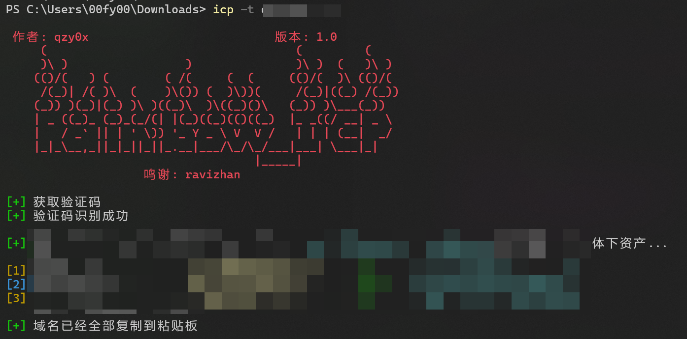

# Rainbow_ICP

七彩icp备案查询工具,调用工信部接口

## 使用

```
python .\main.py -h
```



## 免责声明

1. 本项目仅用于学习、研究和技术测试目的。  
2. 使用本项目进行任何非法活动，包括但不限于侵犯他人隐私、获取未授权数据或用于商业盈利，均与作者无关。  
3. 用户需自行承担因使用本项目造成的任何法律责任。  
4. 作者不保证本项目的完整性、准确性或适用性，对因使用本项目而产生的任何损失或后果不承担任何责任。  
5. 请遵守当地法律法规及相关网站的服务条款，合法合理使用本项目。  

使用本项目即表示您已阅读并同意上述免责声明。
